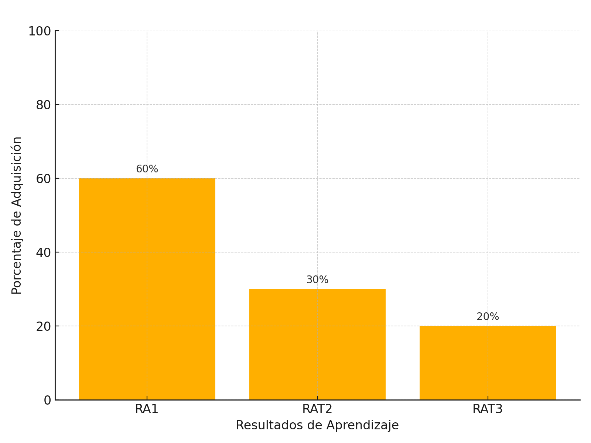

# Unidad Didáctica 1: Arquitectura y Hardware

## 🎯 ¿Qué vas a aprender?

Vas a conocer la arquitectura de un ordenador, sus componentes físicos y lógicos, y aprenderás a identificar, manipular y diagnosticar sistemas informáticos, aplicando criterios de seguridad y sostenibilidad.

## 📏 ¿Cómo se evalúa?

A través de actividades prácticas, diagnósticos simulados, cuadernos de trabajo, informes de práctica, test y autoevaluaciones. Se valorará tu participación, actitud, iniciativa, trabajo en equipo y la calidad de las soluciones propuestas.

## 🔎 ¿Qué haremos?

Desmontarás ordenadores reales o simulados, analizarás su arquitectura, diagnosticarás averías y desarrollarás un proyecto personal: "Construye tu PC ideal".

## ✅ Resultados de aprendizaje

* RA1. Evalúa sistemas informáticos identificando sus componentes.
* RAT2. Desarrolla aprendizaje autónomo.
* RAT3. Aplica principios de sostenibilidad tecnológica.

## 📊 Criterios de evaluación

* 1.a, 1.b, 1.c, 1.d
* rat2.a, rat2.b
* rat3.a, rat3.b

## ⏱ Temporalización

 ⏱️ Duración: 44 horas – Primer trimestre  

 🧩 Bloque: Fundamentos de sistemas informáticos  

 📦 Secuencia: UT1/6

### 📅 Tabla de planificación por actividad

| Tipo de actividad   | Nombre de la actividad                             | Criterios de evaluación utilizados | Temporalización (horas) |
| ------------------- | -------------------------------------------------- | ---------------------------------- | ----------------------- |
| Motivación          | Presentación de la unidad                          | 1.a, rat2.a                        | 1                       |
| Práctica guiada     | Desmontando un PC                                  | 1.a, 1.c, rat3.a                   | 3                       |
| Debate              | Tecnología y sostenibilidad                        | rat3.a, rat3.b                     | 2                       |
| Diagnóstico inicial | Cuestionario y creación de portafolio              | 1.a, rat2.a, rat2.b                | 2                       |
| Exposición guiada   | Arquitectura, buses, memoria                       | 1.a, 1.b                           | 5                       |
| Práctica técnica    | Identificación y montaje de componentes            | 1.a, 1.c                           | 5                       |
| Diagnóstico técnico | Fallos frecuentes                                  | 1.b, 1.d                           | 4                       |
| Investigación       | Consulta de manuales y comparación en PCPartPicker | rat2.b                             | 2                       |
| Simulación          | PC Building Simulator + Cuaderno de tareas         | 1.a, 1.b, rat2.b                   | 4                       |
| Proyecto final      | Diseña tu PC ideal                                 | 1.a, 1.c, rat2.a, rat3.a, rat3.b   | 10                      |
| Evaluación final    | Test + diagnóstico práctico + defensa del proyecto | 1.a, 1.b, 1.c, rat2.a, rat3.a      | 6                       |

---

## 1. Introducción

La informática parte del conocimiento profundo de sus sistemas base. Esta unidad sienta los cimientos del resto del módulo, explorando desde los componentes de hardware hasta las normas de seguridad y uso responsable de recursos.

---

## 2. Objetivos didácticos

* Comprender la arquitectura básica de un ordenador.
* Identificar los componentes de un sistema informático.
* Diagnosticar y resolver averías comunes.
* Aplicar criterios de seguridad en la manipulación de hardware.
* Utilizar herramientas de monitorización.
* Fomentar la sostenibilidad mediante el uso racional del hardware.

---

## 3. Contenidos

* Arquitectura de ordenadores
* Sistemas microinformáticos
* Componentes físicos: placas, CPU, RAM, almacenamiento, buses
* Periféricos y adaptadores
* Puesta en marcha, chequeo, diagnóstico y reparación
* Herramientas de diagnóstico y monitorización
* Representación de la información
* Seguridad laboral y prevención
* Impacto ambiental y reutilización

---

## 4. Actividades y secuenciación

### Fase 1: Introducción y motivación (Sesiones 1 a 4)

#### 🧪 Sesión 1: Presentación de la unidad y objetivos

* **Actividad:** Presenta el módulo y la unidad 1 utilizando una presentación visual alternativa en formato digital accesible desde los dispositivos del alumnado. Se realiza una lluvia de ideas sobre qué conocen de los ordenadores. Introduciremos los RA y los criterios que se evaluarán mediante un esquema compartido. Finalizaremos con una actividad interactiva tipo "Mentimeter" sobre componentes.
* **Material:** Guía del alumno, dispositivos móviles o portátiles, resumen RA/CE en PDF.
* **Criterios de evaluación trabajados:** 1.a, rat2.a
* **Evaluación:** Observación directa sobre la participación, actitud ante la actividad inicial y recogida de impresiones previas mediante el resultado del test interactivo.

#### 🔧 Sesión 2: Dinámica “Desmontando un PC”

* **Actividad:** Los estudiantes, en grupos de 3-4, desmontan un equipo real o simulado. Cada uno asume un rol: coordinador, técnico, documentador y portavoz. Identifican cada componente con una etiqueta adhesiva y lo describen en una tabla. Se utilizan guías impresas con esquemas y funciones de cada componente.
* **Material:** Torre de PC, kits de herramienta, pulseras antiestáticas, guías visuales impresas, fichas de roles, etiquetas autoadhesivas.
* **Criterios de evaluación trabajados:** 1.a, 1.c, rat3.a
* **Evaluación:** Lista de control del docente + rúbrica breve de grupo para valorar organización, comunicación y precisión en la identificación de componentes.

#### 🌱 Sesión 3: Debate – Tecnología y sostenibilidad

* **Actividad:** Visionado de un vídeo sobre el impacto ambiental del hardware. A continuación, los grupos debaten sobre qué decisiones pueden tomarse para mejorar la sostenibilidad desde el rol técnico. Cada grupo plasma sus conclusiones en una cartulina o herramienta colaborativa digital. Finalmente, cada portavoz presenta una medida concreta al resto de la clase.
* **Material:** Vídeo introductorio, guía de debate, herramienta colaborativa digital (ej. Padlet, Jamboard).
* **Criterios de evaluación trabajados:** rat3.a, rat3.b
* **Evaluación:** Escala actitudinal para medir respeto, escucha activa y argumentación + rúbrica para la presentación de propuestas sostenibles.

#### 📝 Sesión 4: Cuestionario diagnóstico + portafolio

* **Actividad:** El alumnado realiza un cuestionario inicial para detectar conocimientos previos sobre hardware, componentes y sostenibilidad. Posteriormente, el docente les explica el portafolio individual de aprendizaje y les entrega una plantilla digital editable. Comienzan a completarla con una ficha de autoevaluación inicial y sus objetivos personales.
* **Material:** Cuestionario en Google Forms, plantilla de portafolio en formato editable, rúbrica de autoevaluación inicial.
* **Criterios de evaluación trabajados:** 1.a, rat2.a, rat2.b
* **Evaluación:** Corrección automática o en clase del cuestionario, revisión del portafolio y ficha de autoevaluación, orientación individual por parte del docente.

### Fase 2: Desarrollo (Sesiones 5 a 18)

* Presentaciones interactivas: arquitectura, buses, memoria
* Prácticas con hardware real/simulado: identificación de componentes
* Actividades de diagnóstico de fallos frecuentes
* Lectura técnica: manuales de fabricantes, PCPartPicker
* Simulación: "PC Building Simulator" + Cuaderno de tareas

### Fase 3: Aplicación (Sesiones 19 a 26)

* Proyecto: "Diseña tu PC ideal para un entorno profesional concreto"
* Práctica: uso de herramientas como HWMonitor, CPU-Z
* Evaluación final teórico-práctica (test + diagnóstico + defensa del proyecto)

---

## 5. Instrumentos de evaluación

* Observación directa (actitud, participación, roles en grupo)
* Cuestionarios tipo test (inicial y final)
* Prácticas técnicas en aula
* Informe técnico de diagnóstico
* Cuaderno de trabajo / portafolio digital
* Autoevaluación y coevaluación por rúbrica
* Presentación y defensa del proyecto

### 📋 Rúbrica: Proyecto “Construye tu PC ideal”

| Criterio                             | Excelente (9-10)                                      | Notable (7-8)                                 | Aprobado (5-6)                                | Insuficiente (1-4)               |
| ------------------------------------ | ----------------------------------------------------- | --------------------------------------------- | --------------------------------------------- | -------------------------------- |
| Justificación técnica de componentes | Argumenta con precisión técnica y contexto            | Argumenta correctamente con algún fallo menor | Justifica parcialmente o con poca profundidad | Sin coherencia técnica           |
| Sostenibilidad y eficiencia          | Plantea soluciones con bajo impacto y alta eficiencia | Aplica algunas medidas sostenibles            | Muestra cierta conciencia ecológica           | Ignora criterios ambientales     |
| Presentación del informe             | Excelente estructura, claridad y lenguaje técnico     | Bien organizado y claro                       | Comprensible pero mejorable                   | Desorganizado, confuso           |
| Defensa oral                         | Expone con seguridad y responde con precisión         | Buena exposición con alguna duda              | Defiende el proyecto de forma básica          | No consigue explicar ni defender |

---

## 6. Recursos y materiales

* Componentes reales (RAM, placas, discos)
* Herramientas (multímetro, destornilladores)
* Software: CPU-Z, HWMonitor, CrystalDiskInfo
* Simuladores: PC Building Simulator, PC Virtual Lab
* Realidad virtual (Meta Quest) si está disponible
* Webs de consulta: Wikipedia, Intel, PCPartPicker, fabricantes
