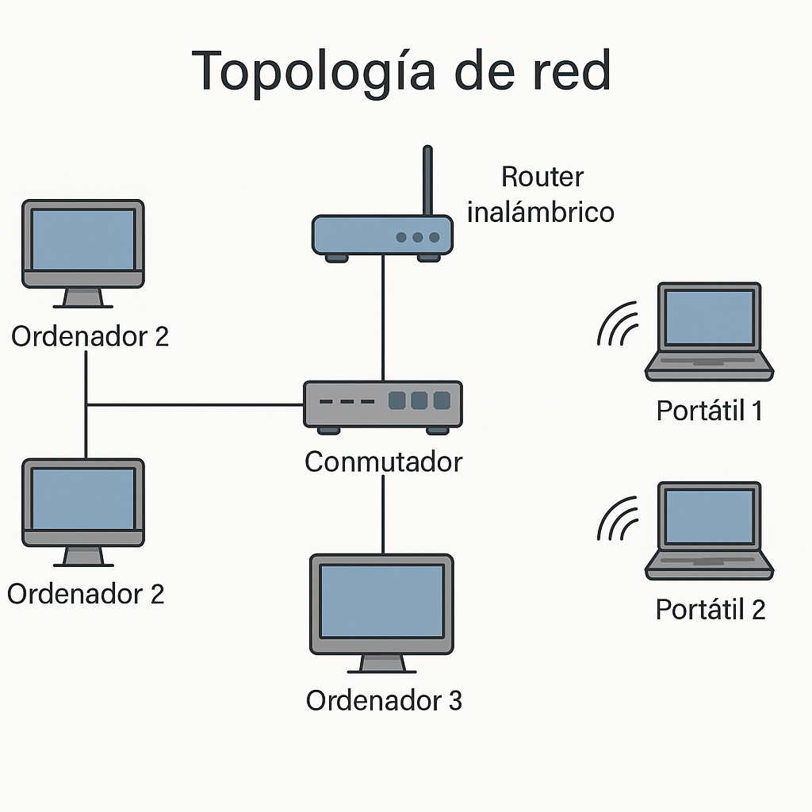

# 🌐 Unidad Didáctica 2 — Redes Básicas y Comunicaciones

## ⏱️ Temporalización global  
- **Duración:** 18 h (11 sesiones) / 160 h  
  - **Lunes:** 2 h · **Martes:** 1 h · **Miércoles:** 2 h  
- **Bloque:** Fundamentos de Sistemas Informáticos  
- **Secuencia anual:** UT 2 / 6  

---  
> **Meta** · Identificar, diseñar y poner en marcha redes locales cableadas e inalámbricas aplicando buenas prácticas de seguridad, sostenibilidad y trabajo colaborativo.

## 🎯 ¿Qué vas a aprender?
* Conceptos básicos de redes (tipos, topologías, medios y dispositivos).
* Diseño de mapas físico-lógicos y cableado estructurado.
* Configuración inicial de redes LAN y Wi-Fi con protocolos TCP/IP.
* Verificación y resolución de incidencias de conectividad.

---  

## 🔎 ¿Qué haremos?
* Montaje de cableado y certificación básica.  
* Simulaciones en **Packet Tracer** / **GNS3**.  
* Diseño de un diagrama de red doméstica/profesional.  
* Proyecto exprés: “Conecta tu aula” mediante switches y puntos de acceso.

---  

## 🎯 Criterios de evaluación y Resultados de aprendizaje

=== "RA1 — Evalúa sistemas informáticos (refuerzo CE 5-8)"
    - **CE 5.** Identifica tipos de redes y sistemas de comunicación.  
    - **CE 6.** Identifica componentes de una red informática.  
    - **CE 7.** Interpreta mapas físico-lógicos de una red local.  
    - **CE 8.** Aplica normas de seguridad y PRL en redes.

=== "RA5 — Interconecta sistemas en red (iniciación)"
    - **CE 33.** Configura el protocolo TCP/IP en un cliente de red.  
    - **CE 34.** Configura redes LAN cableadas.  
    - **CE 35.** Configura redes LAN inalámbricas.  
    - **CE 36.** Utiliza dispositivos de interconexión de redes.

=== "RAT1 — Colabora eficazmente en equipos"
    - **CE 55.** Participa en proyectos grupales asignando roles y usando herramientas de gestión.

=== "RAT2 — Aprendizaje autónomo y pensamiento crítico"
    - **CE 58.** Investiga comparativamente tecnologías de red y documenta conclusiones.

=== "RAT3 — Ciberseguridad y ética digital"
    - **CE 61.** Aplica medidas básicas de seguridad y cifrado en redes.

=== "RAT4 — Sostenibilidad y eficiencia"
    - **CE 64.** Propone soluciones de red con bajo consumo y mínimo impacto medioambiental.

---  

## 📑 Competencias profesionales y para la empleabilidad
- **a)** Configurar y explotar sistemas informáticos.  
- **b)** Aplicar técnicas y procedimientos de seguridad.  
- **o)** Elaborar y mantener documentación técnica.  
- **q)** Resolver contingencias con iniciativa y autonomía.  

---  

## 📏 ¿Cómo se evalúa?
* **Observación directa** (actitud, roles, PRL).  
* **Prácticas técnicas guiadas** con rúbrica (cableado, simulaciones).  
* **Cuestionarios tipo test** en **AULES** (teoría y casos).  
* **Portafolio digital** (diagramas, capturas Packet Tracer).  
* **Proyecto exprés** con defensa oral.  

---

## 🗂️ Planificación por actividades

| # | Tipo | Actividad | RA / RAT · CE | Ses. | H |
|:-:|------|-----------|---------------|:---:|:-:|
| 1 | Intro | Kahoot / Mentimeter “¿Qué sabes de redes?” | **RA1 · RAT2** → CE 5, 58 | 1 | 1 |
| 2 | Des. | Tipos y topologías de red (presentación + mini-debate) | **RA1** → CE 5 | 1 | 1 |
| 3 | Des. | Taller de cableado UTP (crimpado + tester) | **RA5 · RAT1** → CE 34, 55 | 2-3 | 3 |
| 4 | Des. | Simulación LAN en Packet Tracer (switch + 3 PC) | **RA5** → CE 33, 34 | 4-5 | 2 |
| 5 | Des. | Wi-Fi básica con punto de acceso y cifrado WPA2 | **RA5 · RAT3** → CE 35, 61 | 6 | 2 |
| 6 | Compl. | Debate “Cable vs. Wi-Fi: eficiencia y sostenibilidad” | **RAT4** → CE 64 | 7 | 1 |
| 7 | Des. | Creación de mapa físico-lógico con **Draw.io** | **RA1** → CE 7 | 8-9 | 2 |
| 8 | Ap. | Proyecto “Conecta tu aula” (diseño + simulación) | **RA1 · RA5 · RAT1-4** → CE 5-8, 33-36, 55, 58, 61, 64 | 10 | 2 |
| 9 | Eval. | Test + checklist PRL + defensa del proyecto | **RA1 · RA5 · RAT1-4** | 11 | 2 |

*Las sesiones y horas son orientativas; pueden ajustarse según progreso.*  

---  

## 🤝 Atención a la diversidad
??? note "Adaptaciones previstas"
    - **Material adaptado:** fichas en lectura fácil y pictogramas.  
    - **Apoyo visual:** uso de colores y códigos QR para tutoriales vídeo.  
    - **Flexibilidad temporal:** ampliación de plazos para prácticas complejas.

---  

## 1. Introducción
Las redes informáticas permiten compartir recursos y conectar dispositivos. Entender sus fundamentos es esencial antes de avanzar a configuraciones complejas y seguridad perimetral.

---  

## 2. Objetivos didácticos
* Comprender los conceptos básicos de redes y sus topologías.  
* Identificar y utilizar dispositivos de interconexión.  
* Configurar redes LAN y Wi-Fi empleando TCP/IP.  
* Interpretar mapas físico-lógicos.  
* Aplicar buenas prácticas de seguridad y sostenibilidad.  

---  

## 3. Contenidos
* Clasificación de redes (PAN, LAN, MAN, WAN).  
* Topologías: estrella, bus, anillo, malla.  
* Componentes: NIC, switches, routers, AP, cableado y conectores.  
* Arquitectura TCP/IP (capas, direccionamiento IPv4/IPv6).  
* Herramientas básicas de diagnóstico (ping, ipconfig, traceroute).  
* Seguridad elemental: WPA2, cifrado, contraseñas robustas.  
* Normas PRL (ESD, orden y prevención de accidentes).  

---  

## 4. Actividades y secuenciación

### Fase 1: Introducción y motivación (Sesiones 1 a 3)

#### 🧠 Sesión 1: ¿Qué es una red? ¿Dónde la encontramos?
* **Actividad:** Creamos un mural digital en **Padlet** donde recogemos ejemplos cotidianos de redes (casa, instituto, ciudad). Completamos un cuestionario interactivo y analizamos un mapa de red real del aula.  
* **Implementación:**  
  1. Presentamos el concepto de red con imágenes y ejemplos.  
  2. Lluvia de ideas en Padlet con dispositivos conectados.  
  3. Completamos una ficha de lectura con definiciones clave.  
  4. Cuestionario digital para verificar la comprensión.  
* **Criterios:** CE 5, CE 7, CE 58  
* **Instrumentos:** Cuestionario autocorregible, observación directa  

#### 📦 Sesión 2: Elementos de una red local
* **Actividad:** Identificamos los componentes físicos de una red LAN (tarjetas de red, switch, router, cables) y los representamos en un esquema.  
* **Implementación:**  
  1. Observamos y manipulamos físicamente los elementos de red.  
  2. Tomamos fotos y etiquetas para documentar cada uno.  
  3. Diseñamos un esquema visual en papel o **Canva**.  
* **Criterios:** CE 6, CE 7  
* **Instrumentos:** Rúbrica de esquema, participación activa  

#### 🧩 Sesión 3: Tipos de red y medios de transmisión
* **Actividad:** Clasificamos diferentes tipos de red (LAN, WAN, MAN, PAN) y experimentamos con cables y conectores.  
* **Implementación:**  
  1. Completamos una tabla comparativa de tipos de red.  
  2. Conectamos cables RJ-45 y los etiquetamos.  
  3. Probamos continuidad con tester.  
* **Criterios:** CE 5, CE 58  
* **Instrumentos:** Ficha técnica, observación directa, rúbrica de práctica  

---

### Fase 2: Desarrollo (Sesiones 4 a 9)

#### 🔧 Sesión 4: Crimpado y certificación de latiguillos UTP
* **Actividad:** Montamos latiguillos de categoría 6 con conectores RJ-45 y comprobamos su continuidad y atenuación con tester.  
* **Implementación:**  
  1. Demostración guiada de crimpado correcto (orden T-568B).  
  2. Trabajo por parejas para cortar, pelar y crimpar 2 latiguillos.  
  3. Verificación con tester y registro de resultados en hoja de control.  
  4. Puesta en común de errores frecuentes y buenas prácticas.  
* **Criterios:** CE 34, CE 55  
* **Instrumentos:** Checklist de calidad de crimpado, rúbrica de práctica, observación directa  

#### 🖥️ Sesión 5: Simulación LAN en Packet Tracer
* **Actividad:** Diseñamos y validamos una red LAN básica con un switch y tres PC usando Cisco Packet Tracer.  
* **Implementación:**  
  1. Creación del esquema lógico (switch + 3 PC, VLAN 1).  
  2. Configuración de direcciones IPv4 estáticas /24.  
  3. Pruebas de conectividad con `ping` y tabla ARP.  
  4. Captura de pantalla y subida al portafolio digital.  
* **Criterios:** CE 33, CE 34  
* **Instrumentos:** Rúbrica de simulación, captura evidencias, observación directa  

#### 📶 Sesión 6: Configuración de red Wi-Fi segura
* **Actividad:** Configuramos un punto de acceso autónomo con SSID propio y cifrado WPA2-PSK, y conectamos dos dispositivos clientes.  
* **Implementación:**  
  1. Ajuste de canal, ancho y contraseña robusta.  
  2. Asociación de clientes y verificación de señal con `iwconfig`.  
  3. Prueba de transferencia (`iperf3`) para medir caudal.  
  4. Registro de parámetros de seguridad aplicados.  
* **Criterios:** CE 35, CE 61  
* **Instrumentos:** Rúbrica de práctica, checklist de seguridad, observación directa  

#### ⚖️ Sesión 7: Debate «Cable vs Wi-Fi: eficiencia y sostenibilidad»
* **Actividad:** Mesa redonda sobre ventajas, limitaciones y huella energética de cada tecnología.  
* **Implementación:**  
  1. Lectura previa de artículo comparativo (AULES).  
  2. Formación de grupos pro-cable y pro-Wi-Fi (argumentos).  
  3. Debate estructurado y registro de conclusiones en Padlet.  
  4. Votación final y reflexión individual.  
* **Criterios:** CE 58, CE 64  
* **Instrumentos:** Lista de cotejo de participación, diario reflexivo  

#### 🗺️ Sesión 8: Mapa físico-lógico con Draw.io
* **Actividad:** Elaboramos el diagrama físico-lógico del aula conectada, detallando dispositivos, medios y direccionamiento.  
* **Implementación:**  
  1. Boceto en papel según normas de simbología Cisco.  
  2. Digitalización en **Draw.io** con capas y leyenda.  
  3. Inserción de diagrama en portafolio y revisión por pares (modo comentario).  
* **Criterios:** CE 7  
* **Instrumentos:** Rúbrica de diagrama, portafolio digital, observación directa  

#### 🛠️ Sesión 9: Proyecto exprés «Conecta tu aula» (diseño + simulación)
* **Actividad:** En equipos, diseñamos y simulamos la red completa del aula (cable + Wi-Fi), aplicando seguridad y buenas prácticas.  
* **Implementación:**  
  1. Distribución de roles (líder, red cableada, red Wi-Fi, documentación).  
  2. Integración de diagrama Draw.io en Packet Tracer.  
  3. Verificación de conectividad y resolución de incidencias.  
  4. Preparación de presentación para la defensa (sesión 10).  
* **Criterios:** CE 5-8, CE 33-36, CE 55, CE 61, CE 64  
* **Instrumentos:** Rúbrica de proyecto, seguimiento de tareas (Planner), observación directa  

---

### Fase 3: Aplicación y evaluación (Sesiones 10 y 11)

#### 🎤 Sesión 10: Presentación y defensa del proyecto «Conecta tu aula»
* **Actividad:** Cada equipo expone su diseño y demostración funcional ante la clase, justificando decisiones técnicas y sostenibles.  
* **Implementación:**  
  1. Presentación de diagrama, configuración y pruebas en vivo.  
  2. Preguntas de los compañeros y rúbrica de co-evaluación.  
  3. Feedback del docente con recomendaciones de mejora.  
* **Criterios:** CE 7, CE 34-36, CE 55, CE 61, CE 64  
* **Instrumentos:** Rúbrica de presentación, co-evaluación, observación directa  

#### 📝 Sesión 11: Evaluación final y reflexión
* **Actividad:** Realizamos un test objetivo en **AULES**, checklist de PRL y una autoevaluación del aprendizaje.  
* **Implementación:**  
  1. Cuestionario de 20 preguntas (conceptos y casos).  
  2. Revisión de checklist PRL aplicado durante las prácticas.  
  3. Autoevaluación y establecimiento de nuevos objetivos personales.  
* **Criterios:** CE 5-8, CE 33-36, CE 61  
* **Instrumentos:** Cuestionario autocorregible, checklist PRL, rúbrica de autoevaluación  

---  

## 5. Instrumentos de evaluación

| Instrumento | Evidencias | Sesiones |
|-------------|-----------|----------|
| Observación directa | Rúbrica de roles y PRL | Todas |
| Rúbrica de prácticas | Cableado, Packet Tracer, Wi-Fi | 3-6 |
| Cuestionario en AULES | Test teórico y casos prácticos | 1, 11 |
| Portafolio digital | Diagrama de red + capturas CLI/GUI | 7-11 |
| Rúbrica de proyecto | Diseño, sostenibilidad y defensa oral | 10-11 |
| Auto/co-evaluación | Rúbrica simplificada | 11 |

---  

## 📋 Rúbrica síntesis: Proyecto “Conecta tu aula”

| Criterio | Excelente (9-10) | Notable (7-8) | Aprobado (5-6) | Insuf. (1-4) |
|----------|------------------|---------------|----------------|--------------|
| Diagrama físico-lógico | Completo, legible y optimizado | Correcto, mínimos ajustes | Básico con errores menores | Incompleto/confuso |
| Configuración TCP/IP | Funcional y documentada | Funcional, sin incidencia | Parcialmente funcional | No funcional |
| Seguridad aplicada | WPA2 + buenas prácticas | Configuración WPA2 correcta | Seguridad mínima | Sin seguridad |
| Presentación y defensa | Fluida, rigurosa, creativa | Clara y bien estructurada | Comprensible con vacíos | Difícil de seguir |

---

## 📊 Ponderación CE → RA

| RA | Peso módulo |
|----|-------------|
| RA1 (CE 5-8) | 10 % |
| RA5 (CE 33-36) | 15 % |
| RAT 1-4 (extra) | +0,25 c/u |

*Calif. CE = media actividades evidenciadas · Peso CE → Nota RA → Nota Módulo*

---

**¡Redes preparadas, vámonos al siguiente salto!** 🚀
