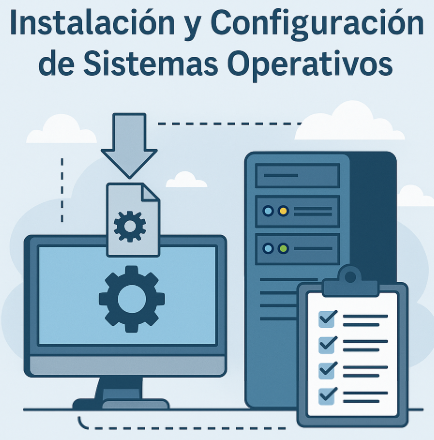

# 💽 Unidad 3: Instalación y Configuración de Sistemas Operativos

> Duración: 30 horas – 18 sesiones  
> Trimestre: 2º  
> Bloque temático: Sistemas operativos y gestión de la información

---

## 🎯 Resultados de Aprendizaje y Criterios de Evaluación

??? info "⚙️ RA2 – Instala sistemas operativos planificando el proceso e interpretando documentación técnica (15%)"
    **Criterios de evaluación:**

    - a) Se ha interpretado la documentación técnica del sistema.
    - b) Se han seleccionado los sistemas operativos teniendo en cuenta las características del sistema.
    - c) Se han interpretado las diferentes fases del proceso de instalación.
    - d) Se ha instalado y verificado el funcionamiento de los sistemas operativos.
    - e) Se han configurado los parámetros del sistema según las especificaciones recibidas.
    - f) Se han documentado las operaciones realizadas.
    - g) Se han utilizado guías y manuales en formato digital o impreso.

    **Porcentajes:**

    | Criterio | Porcentaje |
    |----------|------------|
    | a        | 25%        |
    | b        | 10%        |
    | c        | 15%        |
    | d        | 15%        |
    | e        | 10%        |
    | f        | 15%        |
    | g        | 10%        |

??? info "🧠 RA3 – Gestiona la información del sistema identificando las estructuras de almacenamiento y aplicando medidas para asegurar la integridad de los datos (10%)"
    **Criterios de evaluación:**

    - a) Se han identificado los sistemas de archivos y sus características.
    - b) Se han aplicado técnicas de verificación y mantenimiento del sistema de archivos.
    - c) Se han gestionado dispositivos de almacenamiento.
    - d) Se han aplicado técnicas de particionado, montaje y desmontaje de dispositivos.
    - e) Se han gestionado las tareas programadas del sistema.
    - f) Se han utilizado herramientas para la administración del sistema de archivos.
    - g) Se ha realizado la documentación correspondiente.

    **Porcentajes:**

    | Criterio | Porcentaje |
    |----------|------------|
    | a        | 10%        |
    | b        | 15%        |
    | c        | 10%        |
    | d        | 15%        |
    | e        | 20%        |
    | f        | 20%        |
    | g        | 10%        |

---

## 🧩 Objetivos didácticos

- Instalar y configurar diferentes sistemas operativos.
- Comparar las características y funcionalidades de varios S.O.
- Gestionar sistemas de archivos.
- Documentar los procesos de instalación.
- Configurar automatización básica del sistema.

---

## 📚 Contenidos

- Estructura y funciones de un sistema operativo
- Tipos y clasificación de sistemas operativos
- Instalación en entornos reales y virtuales
- Licencias y software propietario / libre
- Documentación y procesos técnicos
- Gestión de almacenamiento y archivos

---

## 🧠 Conocimientos Previos Necesarios

- Conceptos básicos de hardware (Unidad 1)
- Conectividad física y lógica de red (Unidad 2)

---

## 🛠️ Actividades y secuenciación

### Fase 1: Introducción y motivación (Sesiones 1 a 3)

**Actividad:** Dinámica de grupo: "Elige el sistema operativo ideal para tu cliente".  
- Se presentan casos reales de usuarios con diferentes necesidades (desarrollador, diseñador gráfico, oficina...).
- El alumnado debe analizar sus necesidades y justificar una elección.

**Criterios evaluados:** RA2.a (25%), RA2.b (10%)

---

### Fase 2: Desarrollo (Sesiones 4 a 12)

**Actividades destacadas:**

- **Instalación en máquina virtual (Linux/Windows).**  
  RA2.c, RA2.d, RA2.e, RA2.f  
  Contribución total: 65%

- **Documentación del proceso (informe técnico).**  
  RA2.f, RA2.g, RA3.g  
  Contribución: 15%

- **Gestión de particiones y montaje de unidades.**  
  RA3.a, RA3.c, RA3.d, RA3.e  
  Contribución: 60%

---

### Fase 3: Aplicación (Sesiones 13 a 18)

**Reto final:**  
Implementar un sistema operativo completo en máquina virtual con los siguientes requisitos:

- Documentación paso a paso.
- Gestión de usuarios.
- Automatización de tareas.
- Gestión de almacenamiento.

**Evaluación:** Rúbrica final + defensa del proyecto ante el grupo.

**Criterios evaluados:**  
RA2 completos (100%), RA3 completos (100%)

---

## 🧪 Instrumentos de Evaluación

- Rúbricas de prácticas.
- Cuaderno del alumno (bitácora técnica).
- Checklist de autoevaluación.
- Informe técnico documentado.
- Defensa del proyecto (evaluación oral y escrita).
- Revisión entre pares (feedback entre compañeros).

---

