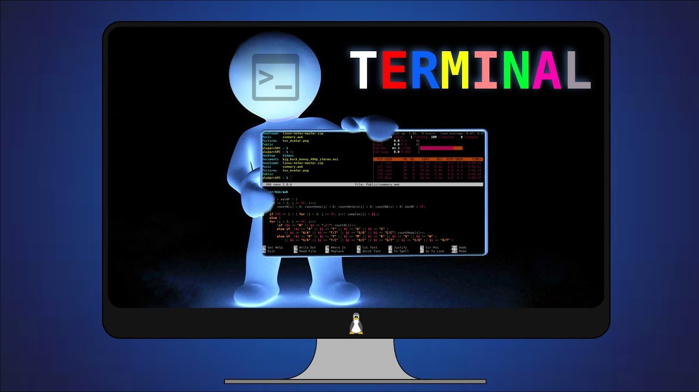

# 🐧 Unidad Didáctica 4 — Administración Básica de Linux

## ⏱️ Temporalización global  
- **Duración:** 30 h (18 sesiones) / 160 h  
  - **Lunes:** 2 h · **Martes:** 2 h · **Miércoles:** 1 h  
- **Bloque:** Sistemas Operativos y Gestión de la Información  
- **Secuencia anual:** UT 4 / 6  

---  
> **Meta** · Gestionar un sistema GNU/Linux a nivel básico (usuarios, permisos, servicios y scripts), aplicando buenas prácticas de seguridad, documentación y sostenibilidad.

## 🎯 ¿Qué vas a aprender?
* Instalación mínima de una distribución GNU/Linux (CLI) y primeros pasos.  
* Navegación por el sistema de archivos y gestión de permisos.  
* Administración de paquetes y actualizaciones con APT/YUM.  
* Gestión de usuarios, grupos, servicios y procesos.  
* Automatización de tareas mediante scripts Bash.  
* Monitorización básica y optimización de recursos.

---  

## 🔎 ¿Qué haremos?
* Talleres prácticos en **VirtualBox** / **WSL**.  
* Desafíos de terminal gamificados con **Terminus**.  
* Creación de scripts de mantenimiento automático.  
* Proyecto exprés: “Servidor LAMP en 45 min” con defensa grabada.

---  

## 🎯 Criterios de evaluación y Resultados de aprendizaje

=== "RA4 — Gestiona sistemas GNU/Linux"
    - **CE 25.** Instala y documenta una distribución Linux mínima.  
    - **CE 26.** Gestiona usuarios, grupos y permisos.  
    - **CE 27.** Administra paquetes y repositorios.  
    - **CE 28.** Configura y controla servicios del sistema.  
    - **CE 29.** Manipula scripts simples para tareas recurrentes.  
    - **CE 30.** Monitoriza recursos y aplica ajustes básicos.  
    - **CE 31.** Resuelve incidencias comunes de forma sistemática.  
    - **CE 32.** Documenta las intervenciones con estándares profesionales. :contentReference[oaicite:0]{index=0}

=== "RAT1-4 — Competencias transversales"
    - **CE 55.** Colabora eficazmente y usa repositorios compartidos.  
    - **CE 58.** Aprende de forma autónoma y reflexiva.  
    - **CE 61.** Integra prácticas de ciberseguridad básicas.  
    - **CE 64 / 67.** Optimiza consumo y promueve sostenibilidad. 

---  

## 📑 Competencias profesionales y para la empleabilidad
- **a)** Configurar y explotar sistemas informáticos.  
- **b)** Aplicar técnicas de seguridad.  
- **o)** Elaborar y mantener documentación técnica.  
- **q)** Resolver contingencias con iniciativa y autonomía.  

---  

## 📏 ¿Cómo se evalúa?
* **Prácticas guiadas** de terminal, servicios y scripting.  
* **Cuestionarios en AULES** sobre comandos y arquitectura.  
* **Portafolio digital** con capturas, scripts y evidencias.  
* **Proyecto exprés** + vídeo-defensa de 5 min.

---

## 🗂️ Planificación por actividades

| # | Tipo | Actividad | RA / RAT · CE | Ses. | H |
|:-:|------|-----------|---------------|:---:|:-:|
| 1 | Intro | Kahoot «Comandos esenciales» | **RA4 · RAT2** → CE 25, 58 | 1 | 1 |
| 2 | Intro | Terminal gamificado con **Terminus** | **RA4** → CE 26 | 2 | 2 |
| 3 | Intro | Instalación mínima Debian CLI | **RA4** → CE 25 | 3 | 2 |
| 4 | Des. | Navegación & permisos (`ls -l`, `chmod`, `chown`) | **RA4** → CE 26 | 4-5 | 3 |
| 5 | Des. | Gestión de paquetes (`apt`, `snap`, `dnf`) | **RA4** → CE 27 | 6 | 2 |
| 6 | Des. | Servicios con `systemd` y logs (`journalctl`) | **RA4** → CE 28 | 7-8 | 3 |
| 7 | Des. | Scripting Bash básico (variables, loops) | **RA4 · RAT2** → CE 29, 58 | 9-10 | 3 |
| 8 | Des. | Monitorización (`htop`, `iotop`, `du`, `df`) | **RA4** → CE 30 | 11 | 2 |
| 9 | Compl. | Debate “Linux & sostenibilidad” | **RAT4** → CE 64 / 67 | 12 | 1 |
|10 | Des. | Documenta tu sistema en Markdown | **RA4 · RAT1** → CE 32, 55 | 13-14 | 3 |
|11 | Ap. | Proyecto “Servidor LAMP en 45 min” | **RA4 · RAT1-4** → CE 25-32, 55-67 | 15-17 | 4 |
|12 | Eval. | Test + checklist PRL + defensa proyecto | **RA4 · RAT1-4** | 18 | 2 |

*Las sesiones y horas son orientativas y se ajustarán al progreso del grupo.*

## 1. Introducción
Linux domina servidores, cloud y DevOps. Dominar su administración básica es imprescindible para el perfil profesional de DAW, permitiendo desplegar servicios web, automatizar tareas y garantizar seguridad y eficiencia.

---

## 2. Objetivos didácticos
* Instalar y configurar distribuciones Linux adaptadas al contexto.  
* Gestionar usuarios, grupos, permisos y sistemas de archivos.  
* Administrar software y servicios del sistema de forma segura.  
* Automatizar tareas rutinarias con scripts Bash.  
* Monitorizar rendimiento y aplicar ajustes de optimización.  
* Documentar procedimientos siguiendo estándares técnicos. :contentReference[oaicite:1]{index=1}

---

## 3. Contenidos
* Instalación de GNU/Linux: requisitos, particionado, GRUB.  
* Administración de paquetes (APT, DNF, Snap).  
* Estructura de directorios y permisos (`chmod`, ACL).  
* Usuarios, grupos y autenticación.  
* Servicios y procesos (`systemd`, `ps`, `top`).  
* Scripts Bash: sintaxis básica, variables, condiciones, bucles.  
* Monitorización (`htop`, `journalctl`, `du`, `df`).  
* Seguridad básica: cortafuegos `ufw`, actualizaciones, buenas prácticas.  
* Documentación técnica: Markdown, estándares wiki. 

---

## 4. Actividades y secuenciación
### Fase 1: Introducción y motivación (Sesiones 1 a 3)

#### 🧠 Sesión 1: ¿Qué comando hace qué?
* **Actividad:** Quiz de 15 preguntas en Kahoot + nube de palabras con comandos conocidos.  
* **Implementación:**  
  1. Lanzamos Kahoot para diagnosticar conocimientos.  
  2. Construimos nube de comandos en Padlet.  
  3. Agrupamos comandos por categoría (navegación, administración).  
* **Criterios:** CE 25, 58 · **Instrumentos:** Kahoot, observación directa.

#### 💻 Sesión 2: Terminus — aventura de terminal
* **Actividad:** Juego por niveles para aprender `cd`, `mkdir`, `cat`, `grep`.  
* **Implementación:**  
  1. Instalamos **Terminus** y superamos 5 misiones cooperativas.  
  2. Cada misión guarda evidencias en carpeta compartida.  
* **Criterios:** CE 26 · **Instrumentos:** Rúbrica de logros, portafolio.

#### 🖥️ Sesión 3: Instalación mínima Debian CLI
* **Actividad:** Instalamos Debian “netinst” en VM (sin entorno gráfico).  
* **Implementación:**  
  1. Creación de VM (2 GB RAM, 20 GB disco).  
  2. Particionado guiado y usuario sudo.  
  3. Primer arranque y actualización inicial (`apt update`).  
* **Criterios:** CE 25 · **Instrumentos:** Checklist instalación, captura GRUB.

---

### Fase 2: Desarrollo (Sesiones 4 a 14)

#### 🗄️ Sesión 4-5: Archivos, directorios y permisos  
* Crip notation `rwx`, grupos, ACL y casos prácticos de seguridad.

#### 📦 Sesión 6: Paquetes y repositorios  
* `apt search`, `apt install`, PPAs vs backports; snapshot antes-después.

#### 🔧 Sesión 7-8: Servicios y logs  
* `systemctl` start/enable, sockets, timers; interpretación de `journalctl`.

#### 📝 Sesión 9-10: Scripting Bash  
* Variables, condicionales, bucles; script que limpia temp, actualiza y notifica.

#### 📊 Sesión 11: Monitorización y optimización  
* Uso de `htop`, `iotop`, logs de disco y red; política de ahorro energético.

#### ♻️ Sesión 12: Debate Sostenible  
* Comparar consumo Windows vs Linux P-state y gobernadores de CPU.

#### 📚 Sesión 13-14: Documenta tu sistema  
* Plantilla Markdown (Office 365) + capturas + README script.

---

### Fase 3: Aplicación y evaluación (Sesiones 15 a 18)

#### 🚀 Sesiones 15-17: Proyecto “Servidor LAMP en 45 min”
* **Objetivo:** VM con Apache, MariaDB, PHP, firewall activo y script post-install.  
* **Roles:** líder, seguridad, base de datos, documentación.  
* **Entrega:** Vídeo 5 min + repo Git con script y manual.

#### 📝 Sesión 18: Evaluación final
* Test AULES (20 items), checklist PRL y defensa del proyecto.

---

## 5. Instrumentos de evaluación (resumen)

| Instrumento | Evidencias | Sesiones |
|-------------|-----------|----------|
| Observación directa | Participación, PRL, roles | Todas |
| Rúbricas prácticas | Permisos, servicios, scripts | 4-11 |
| Cuestionarios AULES | Comandos, teoría Linux | 1, 6, 18 |
| Portafolio digital | Markdown + capturas | 2-14 |
| Rúbrica de proyecto | Tiempo, seguridad, documentación | 15-17 |
| Auto/co-evaluación | Reflexión y feedback | 12, 18 |

## 🛠️ Ejemplos

---

### ✅ Checklist PRL · Administración Linux
| Ítem de seguridad | Sí | No | N/A |
|-------------------|:--:|:--:|:---:|
| Taller ordenado y libre de cables sueltos | □ | □ | □ |
| Pulsera ESD / tapete antiestático al manipular HW | □ | □ | □ |
| Anotación de incidencias en parte de taller | □ | □ | □ |
| Uso de cuentas con privilegios limitados | □ | □ | □ |
| Aplicación de actualizaciones antes de exponer el servicio | □ | □ | □ |

---

### 🗂️ Rúbrica · Instalación Debian CLI  
| Criterio | Excelente (9-10) | Notable (7-8) | Aprobado (5-6) | Insuficiente (<5) |
|----------|------------------|---------------|----------------|-------------------|
| Planificación y particionado | Particionado LVM correcto, `/`, `/home`, swap documentados | Particionado correcto sin LVM | Particionado guiado con errores menores | Particiones incorrectas |
| Proceso de instalación | Sin errores, < 20 min | < 30 min | < 40 min | Fallos recurrentes |
| Configuración de red y actualización | IP/hostname correctos + `apt upgrade` | Red correcta o actualización | Red y actualización parciales | Sin red o sin actualización |
| Seguridad inicial | Usuario sudo + SSH desactivado + firewall activo | 2 de 3 ítems | 1 de 3 ítems | Sin ítems |
| Evidencias (portafolio) | Capturas + log completo | Capturas sin log | Log incompleto | Sin evidencias |

---

### 🔐 Rúbrica · Permisos y sistema de archivos  
| Dimensión | Excelente (9-10) | Notable (7-8) | Aprobado (5-6) | Insuficiente (<5) |
|-----------|------------------|---------------|----------------|-------------------|
| Manejo de comandos (`chmod`, `chown`, ACL) | Ejemplos avanzados (ACL, SGID) sin errores | Todos los comandos básicos correctos | 1-2 errores leves | Errores graves o uso incorrecto |
| Resolución de casos prácticos | 100 % casos resueltos y justificados | 80 % | 60 % | < 60 % |
| Documentación en Markdown | Paso a paso + explicación | Explica comandos | Solo comandos | Sin documentación |

---

### ⚙️ Rúbrica · Servicios systemd & logs  
| Criterio | Excelente (9-10) | Notable (7-8) | Aprobado (5-6) | Insuficiente (<5) |
|----------|------------------|---------------|----------------|-------------------|
| Creación y habilitación de servicio | Unidad propia `.service` funciona a arranque | Servicio funciona pero sin habilitar | Servicio manual, sin unidad | Servicio no funciona |
| Gestión de logs (`journalctl`) | Filtros avanzados + rotación configurada | Consulta básica de logs | Logs consultados parcialmente | No consulta logs |
| Seguridad y hardening | Parámetros `PrivateTmp`, `ProtectSystem` aplicados | 1 parámetro hardening | Sin hardening | Error en parámetros |
| Evidencias | Capturas + unidad adjunta | Capturas | Descripción sin capturas | Sin evidencias |

---

### 📝 Rúbrica · Script Bash de mantenimiento  
| Dimensión | Excelente (9-10) | Notable (7-8) | Aprobado (5-6) | Insuficiente (<5) |
|-----------|------------------|---------------|----------------|-------------------|
| Funcionalidad | Automatiza ≥ 6 tareas sin errores | 4-5 tareas | 2-3 tareas | ≤ 1 tarea o errores |
| Legibilidad y comentarios | Código modular y documentado | Comentarios parciales | Pocos comentarios | Sin comentarios |
| Gestión de errores | Manejo exhaustivo (`trap`, validaciones) | Control 1-2 errores | Control mínimo | Sin control |
| Portabilidad | Sin rutas fijas, variables param. | 1-2 rutas fijas | Varias rutas fijas | No portable |
| Documentación (README) | Uso, requisitos, ejemplos | Uso + requisitos | Solo uso | Sin README |

---

### 🚀 Rúbrica · Proyecto “Servidor LAMP en 45 min”
| Área | Peso | Excelente (9-10) | Notable (7-8) | Aprobado (5-6) | Insuficiente (<5) |
|------|:---:|------------------|---------------|----------------|-------------------|
| Tiempo total | 20 % | ≤ 45 min | 46-55 min | 56-65 min | > 65 min |
| Funcionalidad (Apache, PHP, MariaDB) | Servicio operativo + prueba PHP-MySQL | 1 servicio con aviso | 2 servicios con aviso | > 2 fallos |
| Seguridad básica | UFW activo, puertos mínimos, actualizaciones | 2 de 3 ítems | 1 de 3 ítems | 0 ítems |
| Script post-install | Ejecuta sin errores, log limpio | 1 aviso | 2 avisos | Error crítico |
| Documentación (Markdown + vídeo) | Completa, README y enlace vídeo | Markdown completo | Markdown parcial | Sin documentación |

---

### 📂 Portafolio digital · Lista de cotejo
- [ ] Carpeta `ud4/` creada en OneDrive clase  
- [ ] Capturas numeradas de comandos clave (≥ 10)  
- [ ] Archivos `.service` y scripts Bash en repo Git  
- [ ] Fichero `README.md` con tabla de versiones y hardening  
- [ ] Vídeo demostración ≤ 4 min enlazado  

---

### 🎯 Cuestionario AULES · Comandos y arquitectura Linux  
*(Banco de 25 ítems autocorregibles — muestra)*  
1. **¿Qué comando muestra los usuarios conectados?**  
   a) `w` b) `whoami` c) `last` d) `users`  
2. Relaciona `systemctl`, `journalctl`, `htop` con su función.  
3. **Respuesta breve:** Ventajas de usar ACL frente a permisos tradicionales.  
4. *Ordena pasos:* Instalación de un paquete desde repositorio.  
5. **Hotspot:** Señala en la captura de `htop` la sección de carga media.  
---

**¡Terminal preparado, comando… ejecutar!** 🚀
