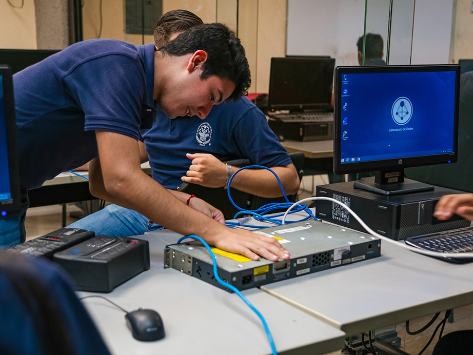

# 🚀 Unidad Didáctica 6 — Administración Avanzada y Proyectos

## ⏱️ Temporalización global  
- **Duración:** 15 h (9 sesiones) / 160 h  
  - **Lunes:** 2 h · **Martes:** 2 h · **Miércoles:** 1 h  
- **Bloque:** Redes y Seguridad  
- **Secuencia anual:** UT 6 / 6  

---  
> **Meta** · Integrar todos los conocimientos previos para automatizar el despliegue y mantenimiento de un **servidor web seguro contenerizado** (Docker-Compose), aplicando políticas de backup, hardening y documentación profesional.  

## 🎯 ¿Qué vas a aprender?
* Shell scripting avanzado y automatización de mantenimiento.  
* Virtualización ligera (Docker, LXC) y alta disponibilidad básica.  
* Backup, snapshots y recuperación ante desastres.  
* Despliegue completo de un servidor web seguro (HTTPS, firewall, IDS).  
* Documentación profesional y defensa de proyectos.  

---  

## 🔎 ¿Qué haremos?
* Laboratorios en **Proxmox** / **Docker**.  
* Scripts Bash avanzados con control de errores.  
* docker-compose con varias redes, backup y restore.  
* Proyecto final: “Servidor web seguro con Docker-Compose y hardening” con presentación grabada.  

---  

## 🎯 Criterios de evaluación y Resultados de aprendizaje

=== "RA6 — Operar servicios avanzados (43-47)"
    - **CE 43.** Implementa scripts de copia y restauración automatizada.  
    - **CE 44.** Configura servicios en alta disponibilidad básica.  
    - **CE 45.** Gestiona usuarios y permisos en entornos multi-nodo.  
    - **CE 46.** Aplica hardening y políticas de firewall en servicios expuestos.  
    - **CE 47.** Documenta incidencias y genera informes de servicio. :contentReference[oaicite:0]{index=0}

=== "RA7 — Planifica y ejecuta proyectos de sistemas (48-54)"
    - **CE 48.** Analiza requisitos y elige tecnologías adecuadas.  
    - **CE 49-50.** Despliega la solución y verifica KPIs de rendimiento.  
    - **CE 51.** Presenta la solución justificando decisiones técnicas.  
    - **CE 52-54.** Evalúa impacto, coste y sostenibilidad. :contentReference[oaicite:1]{index=1}

=== "RAT1-4 — Competencias transversales"
    - **CE 57, 60, 63, 65.** Trabajo en equipo, autoaprendizaje, ciberseguridad y sostenibilidad. :contentReference[oaicite:2]{index=2}

---  

## 📑 Competencias profesionales y para la empleabilidad
- **a)** Configurar y explotar sistemas informáticos.  
- **b)** Aplicar técnicas de seguridad.  
- **o)** Elaborar y mantener documentación técnica.  
- **q)** Resolver contingencias con iniciativa y autonomía.  

---  

## 📏 ¿Cómo se evalúa?
* **Prácticas avanzadas** de scripting, HA y backups.  
* **Cuestionarios AULES** sobre HA y virtualización.  
* **Portafolio digital** (Markdown + capturas + scripts).  
* **Proyecto final** con rúbrica y defensa en vídeo.  

---

## 🗂️ Planificación por actividades

| # | Tipo | Actividad                                 | RA / RAT · CE       | Ses. | H |
|:-:|------|-------------------------------------------|---------------------|:---:|:-:|
| 1 | Intro | Kahoot “¿Qué es HA?” + debate tendencias | **RA6 · RAT2** → 43, 58 | 1 | 2 |
| 2 | Intro | Laboratorio Docker & Compose             | **RA6** → 44, 45    | 2 | 2 |
| 3 | Des.  | Backup y snapshot automático (Borg)      | **RA6** → 43, 46    | 3 | 1 |
| 4 | Des.  | Despliegue LAMP con Docker-Compose       | **RA6** → 44-46     | 4 | 2 |
| 5 | Des.  | Hardening: Fail2ban + UFW                | **RA6 · RAT3** → 46, 61 | 5 | 2 |
| 6 | Des.  | Bash avanzado: control de errores + logs | **RA6** → 43, 47    | 6 | 1 |
| 7 | Des.  | Plan de proyecto y reparto de roles      | **RA7 · RAT1** → 48, 55 | 7 | 2 |
| 8 | Ap.   | Proyecto “Servidor web seguro”           | **RA6-7 · RAT1-4**  | 8 | 2 |
| 9 | Eval. | Test + defensa grabada del proyecto      | **RA6-7 · RAT1-4**  | 9 | 1 |

*Las sesiones y horas son orientativas; se ajustarán según progreso.*

---
## 1. Introducción
Esta unidad cierra el módulo integrando redes, sistemas y seguridad en un proyecto realista de producción. El alumnado desarrollará competencias para automatizar, securizar y mantener servicios críticos, reforzando la empleabilidad en roles DevOps y SysAdmin. :contentReference[oaicite:3]{index=3}  

---

## 2. Objetivos didácticos
* Automatizar tareas complejas con scripts robustos.  
* Desplegar servicios en alta disponibilidad básica.  
* Implementar y documentar políticas de backup y hardening.  
* Evaluar el rendimiento y la sostenibilidad de la solución.  
* Presentar y defender proyectos con rigor profesional. :contentReference[oaicite:4]{index=4}  

---

## 3. Contenidos
* Shell scripting avanzado: funciones, traps, manejo de errores.  
* Virtualización ligera (Docker, LXC) y orquestación básica.  
* Alta disponibilidad: balanceo RR y réplica.  
* Copias de seguridad y snapshotting.  
* Hardening y firewall (UFW, Fail2ban).  
* Monitorización (`htop`).  
* Metodología DevOps: Git, CI/CD simplificado.  
* Documentación técnica (Markdown, diagrams.net). :contentReference[oaicite:5]{index=5}  

---

## 4. Actividades y secuenciación
### Fase 1: Introducción y motivación (Sesiones 1-2)

#### 🎯 Sesión 1: Alta disponibilidad, ¿mito o realidad?
* **Actividad:** Quiz en Kahoot y debate sobre casos de caídas famosas.  
* **Implementación:**  
  1. Kahoot (12 preguntas).  
  2. Grupos de debate: Amazon AWS 2020 vs GitHub 2023.  
  3. Conclusiones en Padlet.  
* **Criterios:** 43, 58 · **Instrumentos:** Kahoot, observación directa.

#### 🐳 Sesión 2: Docker Compose en 20 min
* **Actividad:** Levantamos un servicio Nginx + MariaDB con Docker Compose.  
* **Implementación:**  
  1. Creación de `docker-compose.yml`.  
  2. Persistencia en volúmenes y redes bridge.  
  3. Prueba de escalado `docker compose up --scale`.  
* **Criterios:** 44, 45 · **Instrumentos:** Rúbrica CLI, captura en portafolio.

---

### Fase 2: Desarrollo (Sesiones 3-7)

* **Sesión 3:** Backups automáticos con Borg + cron, verificación y restore.  
* **Sesión 4:** Pila LAMP.  
* **Sesión 5:** Firewall UFW + Fail2ban, reglas y simulación de ataque.  
* **Sesión 6:** Script Bash “health-check” con `trap`, logs y mail.  
* **Sesión 7:** Redacción dossier de proyecto, reparto de tareas y KPIs.

---

### Fase 3: Aplicación y evaluación (Sesiones 8-9)

#### 🚀 Sesión 8: Proyecto “Servidor web seguro en clúster”
* **Entrega:** clúster vivo + script deploy + documentación Git + vídeo.  
* **Roles:** DevOps, Seguridad, Documentación.

#### 📝 Sesión 9: Evaluación final
* Cuestionario AULES (15 ítems).  
* Defensa individual de 3 min frente a rúbrica de proyecto.

---

## 5. Instrumentos de evaluación (resumen)

| Instrumento          | Evidencias                                   | Sesiones |
|----------------------|----------------------------------------------|:--------:|
| Observación directa  | Participación, PRL, roles                    | Todas    |
| Rúbricas prácticas   | Backups, HA, hardening                       | 2-7      |
| Cuestionarios AULES  | HA, scripting, sostenibilidad                | 1, 6, 9  |
| Portafolio digital   | Markdown + capturas + scripts                | 2-8      |
| Rúbrica de proyecto  | Diseño, implementación, seguridad, docu      | 8-9      |
| Auto/co-evaluación   | Reflexión y feedback                         | 7, 9     |

---
## 🛠️ Ejemplos

### ✅ Checklist PRL · Entorno de virtualización
| Ítem de seguridad | Sí | No | N/A |
|-------------------|:--:|:--:|:---:|
| VM y contenedores etiquetados y aislados | □ | □ | □ |
| Backups verificados antes de actualizar | □ | □ | □ |
| Se documentan cambios en Git antes de `push` | □ | □ | □ |
| Firewall activo durante toda la práctica | □ | □ | □ |
| CPU/RAM limitadas para evitar sobrecargas | □ | □ | □ |

---

### 📜 Rúbrica · Script Backup & Restore  
| Criterio | Excelente (9-10) | Notable (7-8) | Aprobado (5-6) | Insuficiente (<5) |
|----------|------------------|---------------|----------------|-------------------|
| Funcionalidad | Copia, comprime, cifra, verifica y restaura | Copia y verifica | Copia sin verificación | Falla o no restaura |
| Gestión de errores | Exhaustiva (`trap` + log) | Control 1-2 fallos | Control mínimo | Sin control |
| Portabilidad | Sin rutas fijas, variables y args | 1-2 rutas fijas | Varias rutas fijas | No portable |
| Documentación | README + ejemplos | Uso y requisitos | Solo uso | Sin README |

---

### 🚀 Rúbrica · Proyecto “Servidor web seguro”
| Área | Peso | Excelente (9-10) | Notable (7-8) | Aprobado (5-6) | Insuficiente (<5) |
|------|:---:|------------------|---------------|----------------|-------------------|
| Diseño & KPIs | 20 % | Diagrama + KPIs y riesgos | Diagrama completo | Diagrama básico | Incompleto |
| Implementación | 30 % | HA, HTTPS, IDS, backup ok | 3 de 4 ok | 2 de 4 ok | ≤ 1 ok |
| Documentación | 20 % | Markdown + vídeo + Git tags | Markdown completo | Markdown parcial | Sin docu |
| Sostenibilidad | 15 % | Consumo < 60 W medio | < 70 W | < 80 W | ≥ 80 W |
| Defensa oral | 15 % | Clara, técnica y convincente | Clara y correcta | Comprensible | Confusa |

---

### 📂 Portafolio digital · Lista de cotejo
- [ ] Carpeta `ud6/` en OneDrive clase  
- [ ] Scripts y `docker-compose.yml` versionados en Git  
- [ ] Capturas de métricas y dashboards numeradas (≥ 8)  
- [ ] README con arquitectura, KPIs y consumo estimado  
- [ ] Vídeo demo ≤ 4 min enlazado  

---

**¡Proyecto listo, sistemas a prueba de fallos!** 🔒